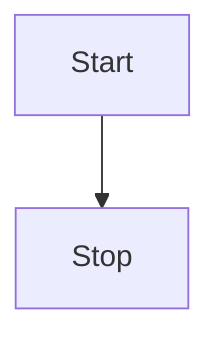

# MermaidEncoderPlugin

This Structurizr DSL plugin looks for inline Mermaid diagram definitions in Markdown/AsciiDoc documentation,
and encodes them as images. For example, this definition in Markdown content:

````

````

Will be converted to:

```

```

Which renders as:


## Usage

Add the plugin, and reference it from your DSL file as follows:

```
!plugin mermaid.MermaidEncoderPlugin
```

This should appear after any `!docs` and/or `!adrs` statements that import documentation into your workspace.

By default, the public Mermaid service (`https://mermaid.ink`) will be used, but you can specify a parameter to change this:

```
!plugin mermaid.MermaidEncoderPlugin {
    "mermaid.url" "http://localhost"
}
```


