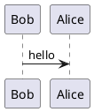

# PlantUMLEncoderPlugin

This Structurizr DSL plugin looks for inline PlantUML diagram definitions in Markdown/AsciiDoc documentation,
and encodes them as images. For example, this definition in Markdown content:

````

````

Will be converted to:

```

```

Which renders as:


## Usage

Add the plugin, and reference it from your DSL file as follows:

```
!plugin plantuml.PlantUMLEncoderPlugin
```

This should appear after any `!docs` and/or `!adrs` statements that import documentation into your workspace.

By default, the public PlantUML installation (`https://www.plantuml.com/plantuml`) will be used, but you can specify a parameter to change this:

```
!plugin plantuml.PlantUMLEncoderPlugin {
    "plantuml.url" "http://localhost:8080/plantuml"
}
```


