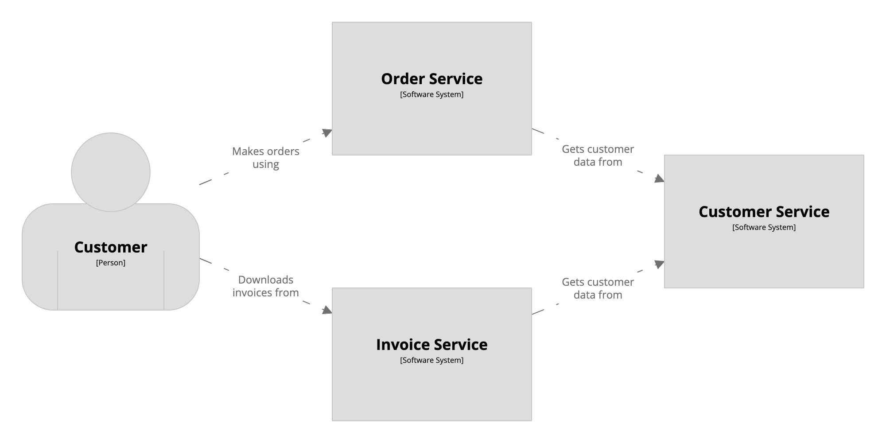

## System catalog example

- [catalog.dsl](dsl/catalog.dsl): a catalog of people and software systems (this excludes any relationships)
- [order-service/workspace.dsl](dsl/order-service/workspace.dsl): extends `catalog.dsl` to provide detail about the "Order Service"
- [invoice-service/workspace.dsl](dsl/invoice-service/workspace.dsl): extends `catalog.dsl` to provide detail about the "Invoice Service"
- [customer-service/workspace.dsl](dsl/customer-service/workspace.dsl): extends `catalog.dsl` to provide detail about the "Customer Service"
- [system-landscape/workspace.dsl](dsl/system-landscape/workspace.dsl): extends `catalog.dsl` and uses a [plugin](https://github.com/structurizr/examples/blob/main/dsl/system-catalog/plugin/src/main/java/FindRelationshipsPlugin.java) to generate a dynamically aggregated system landscape view

