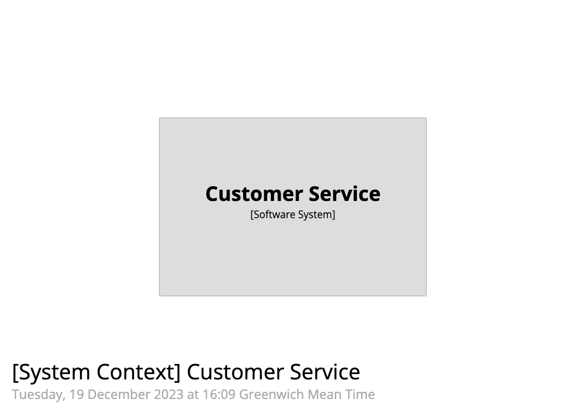
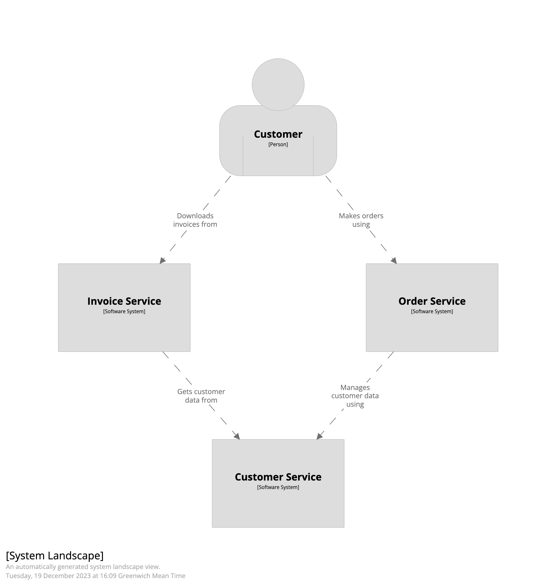

# Enterprise-wide modelling with Structurizr

This Java project contains a number of examples of how to approach enterprise-wide modelling with the Structurizr tooling.

- [Example 1: Enterprise modelling with the Structurizr DSL, with on-premises installation](#example-1)
- [Example 2: Enterprise modelling with the Structurizr DSL, without on-premises installation](#example-2)
- [Example 3: Backstage as a system catalog + system modelling with the Structurizr DSL](#example-3)
- [Example 4: Import Backstage to Structurizr](#example-4)

## Example 1

This example use a combination of the Structurizr on-premises installation, Structurizr DSL, and the Structurizr for Java library.
There are 3 software system scoped workspaces, each defined using the Structurizr DSL,
which are perhaps owned and maintained by 3 separate teams:

- [customer service](src/main/resources/example1/customer-service/workspace.dsl)
- [invoice service](src/main/resources/example1/invoice-service/workspace.dsl)
- [order service](src/main/resources/example1/order-service/workspace.dsl)

All people and software systems used across the enterprise are defined in a [system catalog workspace](src/main/resources/example1/system-catalog.dsl),
again defined using the Structurizr DSL. Note that this system catalog doesn't define any relationships.
Each of the software system scoped workspaces `extends` this system catalog, and adds detail for that one specific
software system via the `!extend` keyword.

The code in the [Example1 class](src/main/java/org/example/Example1.java):

1. Starts up a Structurizr on-premises installation (via Docker).
2. Loads the 3 example workspaces (above).
3. Automatically generates a system landscape diagram.

To run this (you will need Java 17+ and Docker installed):

```
./gradlew run -PmainClass=org.example.Example1
```

Here are the resulting diagrams:

| Customer service system context                                                                   | Invoice service system context                                                                 | Order service system context                                                             | System landscape (generated)                                                 |
|---------------------------------------------------------------------------------------------------|------------------------------------------------------------------------------------------------|------------------------------------------------------------------------------------------|------------------------------------------------------------------------------|
| [](images/example1/customer-service.png) | [](images/example1/invoice-service.png) | [](images/example1/order-service.png) | [](images/example1/landscape.png) |

## Example 2

This is the same as example 1, except that it doesn't use an on-premises installation as a repository for all workspaces.
Instead, all DSL files are simply loaded from disk.

To run this (you will need Java 17+ and Docker installed):

```
./gradlew run -PmainClass=org.example.Example2
```

The resulting system landscape diagram is the same as example 1 (above).

## Example 3

This example uses Backstage as a system catalog only (i.e. it ignores components, resources, etc),
providing a way for individual teams to describe their software system via the Structurizr DSL.

The code in the [Example3 class](src/main/java/org/example/Example3.java):

1. Starts up a Structurizr on-premises installation (via Docker).
2. Downloads the set of entities defined in the [Backstage demo instance](https://demo.backstage.io) (via https://demo.backstage.io/api/catalog/entities).
3. Creates a Structurizr workspace containing all Backstage systems (entity kind `System`), and exports this to [system-catalog.json](src/main/resources/example3/system-catalog.json).
4. Loads [an example Structurizr DSL workspace](src/main/resources/example3/podcast/workspace.dsl), which extends the system catalog and adds containers for the `podcast` system.
5. Automatically generates a system landscape diagram.

To run this (you will need Java 17+ and Docker installed):

```
./gradlew run -PmainClass=org.example.Example3
```

## Example 4

This example imports a Backstage catalog into a Structurizr on-premises installation, providing an alternative way to visualise/navigate the data.

Although [Spotify uses an approach based upon the C4 model](https://engineering.atspotify.com/2022/07/software-visualization-challenge-accepted/),
mapping Backstage entities to the C4 model (and Structurizr) may be problematic for some organisations, depending on
how they have interpreted the [Backstage system model](https://backstage.io/docs/features/software-catalog/system-model)
and therefore what they are registering in Backstage. The example code works as follows:

- Backstage system -> Structurizr software system
- Backstage component -> Structurizr container
- Backstage resource -> Structurizr container

The code in the [Example4 class](src/main/java/org/example/Example4.java):

1. Starts up a Structurizr on-premises installation (via Docker).
2. Downloads the set of entities defined in the [Backstage demo instance](https://demo.backstage.io) (via https://demo.backstage.io/api/catalog/entities).
3. Creates a Structurizr workspace containing all Backstage systems (entity kind `System`).
4. Creates one Structurizr workspace per Backstage system that includes:
   1. Backstage components (entity kind `Component` and `Resource`) defined as Structurizr containers.
   2. Relationships from containers inside the software system, and from containers to other software systems.
6. Automatically generates a system landscape diagram.

To run this (you will need Java 17+ and Docker installed):

```
./gradlew run -PmainClass=org.example.Example4
```

